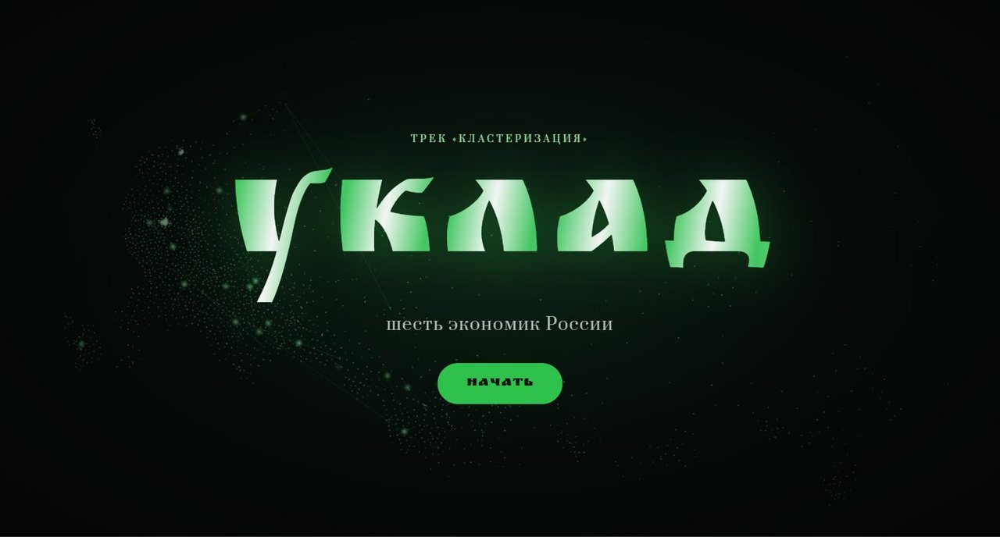
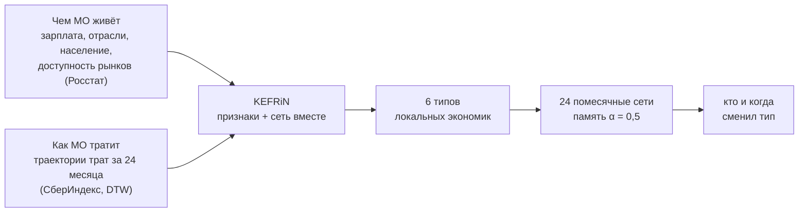
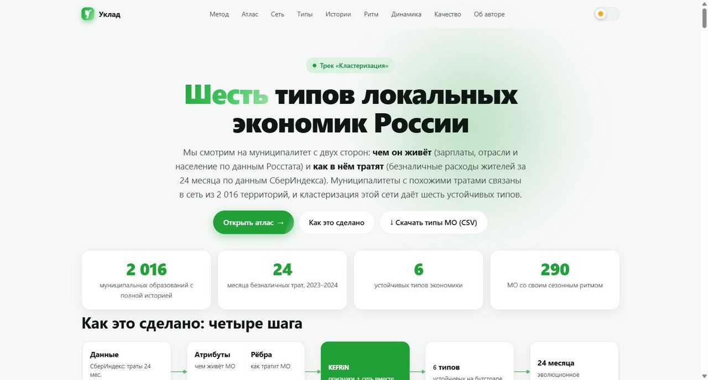
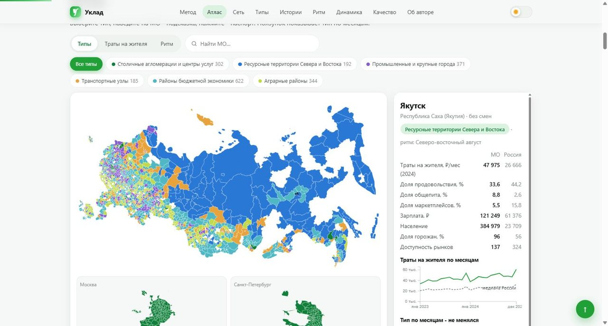
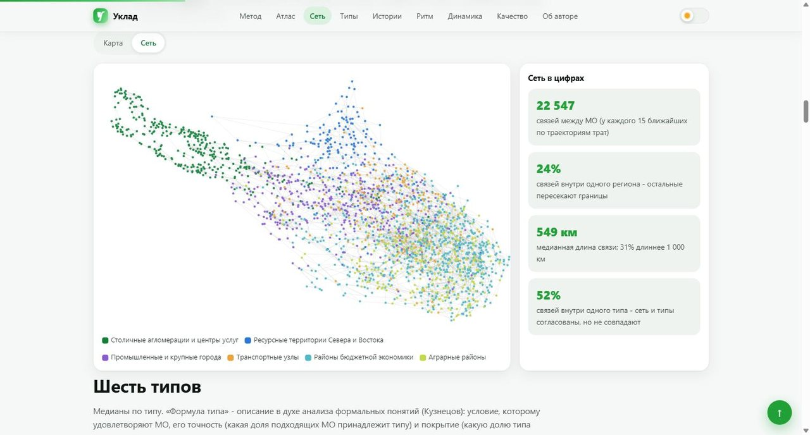
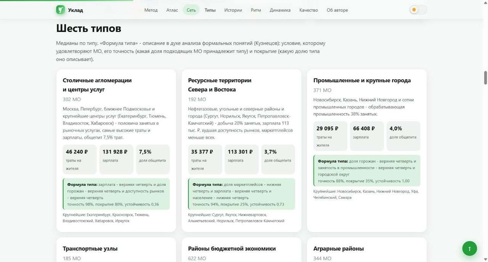
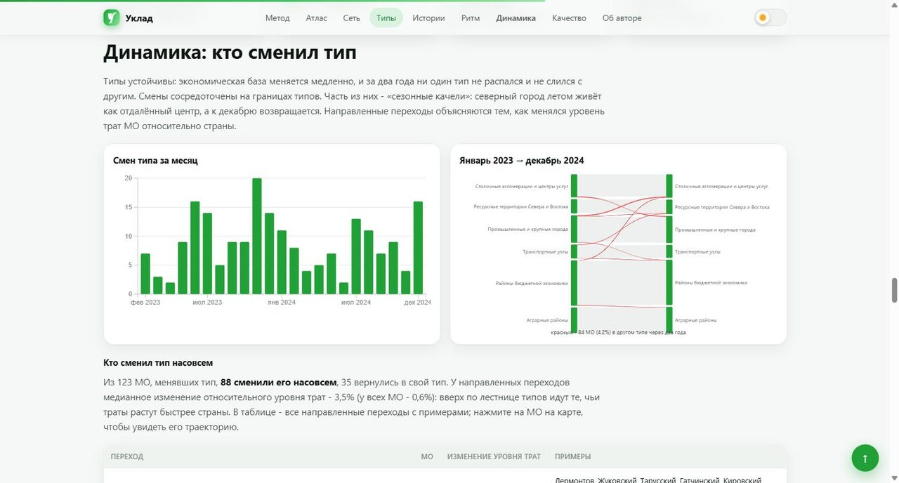
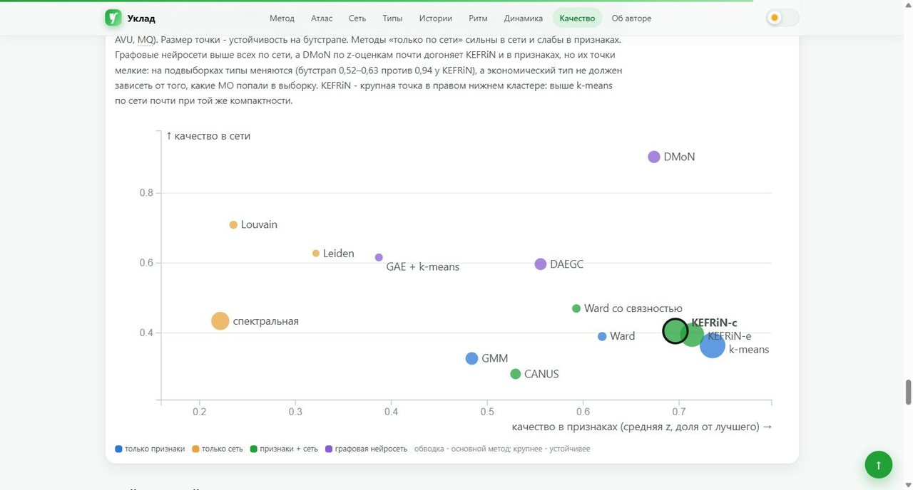

# Уклад: шесть экономик России



Решение для онлайн-конкурса СберИндекса 2026, трек «Кластеризация»: кластеризация атрибутированной сети
2 016 муниципальных образований по данным СберИндекса и Росстата, динамика типов за 24 месяца и их экономическая интерпретация.

## Уклад за 5 минут



**Метод ДУЭТ:** атрибуты узла описывают экономическую базу МО, рёбра сети описывают поведение трат. Одни и те же данные
не учитываются дважды, поэтому вклад сети измерим.

**Пять главных выводов**

1. **Шесть устойчивых типов:** столичные агломерации, ресурсные территории Севера и Востока, промышленные и крупные
   города, транспортные узлы, районы бюджетной экономики, аграрные районы. Шесть — наибольшее число, при котором
   каждый тип воспроизводится на подвыборках.
2. **Сеть трат делает типы точнее.** KEFRiN первый среди 13 методов (включая графовые нейросети); по сравнению с k-means
   тип меняется у 11% МО, и они попадают к соседям по образу трат.
3. **Типы — реальная экономика, а не артефакт модели.** Типы, построенные без зарплаты, объясняют 73% её разброса;
   независимый индекс мобильности СберИндекса — на 54%.
4. **Динамика без шума.** 0,44% смен типа в месяц против 1,4% без памяти; 88 МО сменили тип насовсем. Как группа смены
   статистически реальны, отдельные МО — кандидаты для проверки.
5. **Неравенство растёт.** Разрыв в тратах между самым богатым и самым бедным типом вырос за год с 97 до 101 п. п.
   (95% интервал изменения +2,9…+4,9).

**С чего начать:** отчёт `report/uklad_methodology.pdf` (раздел 0 — одна страница), затем лендинг `site/index.html`.

- **Лендинг** (презентация результатов): `site/index.html` — один автономный файл, открывается с диска без сервера и интернета;
  светлая и тёмная темы, вёрстка для телефона. Схема решения, атлас с паспортом любого МО и его экономическими двойниками
  (ссылка на МО — `index.html#mo=<id>`), сравнение двух МО, пять историй конкретных МО, карточки и «отпечатки» типов,
  «ландшафт Энгеля», «кто уходит в отрыв», «часы ритма», динамика, сравнение методов, словарь терминов с подсказками;
  кнопка «Скачать типы МО (CSV)».
  Печатная версия — `site/uklad.pdf`.
- **Методологический отчёт** — главный документ для чтения, один PDF: `report/uklad_methodology.pdf` (исходник — `report/uklad_methodology_src.md`, собранный текст — `report/uklad_methodology.md`, приложения — `report/uklad_appendix.md`).
- **Презентация**: `docs/uklad_slides.pdf` (12 слайдов; собирается `python scripts/s22_slides.py`).
- **Проверка воспроизводимости с нуля**: `docs/reproduce_check.md` (свежий клон, скачивание данных, сверка SHA-256).
- **Конфигурации**: `configs/pipeline.yaml` (все гиперпараметры), `configs/typology.yaml` (имена типов и ритмов).

## Как выглядит сервис

Лендинг `site/index.html` открывается с диска, без сервера и интернета.

| | |
|---|---|
|  |  |
| **Первый экран:** идея и главные цифры | **Атлас:** тип каждого МО по месяцам, поиск, паспорт с экономическими двойниками |
|  |  |
| **Сеть:** переход «карта → сеть», МО рядом, если похожи траектории трат | **Типы:** профиль, «формула типа», крупнейшие МО |
|  |  |
| **Динамика:** смены типа по месяцам и переходы за два года | **Качество:** 13 методов на карте компромисса «признаки против сети» |

## Идея

Муниципалитет описывается двумя взглядами:

- **атрибуты узла — «чем живёт» МО**: зарплата, население, доля горожан, доступность рынков, структура занятости по шести укрупнённым отраслям (Росстат, СберИндекс) и уровень трат на жителя;
- **рёбра — «как в нём тратят»**: два МО связаны, если похожи их траектории безналичных трат за 24 месяца — уровень
  и структура корзины (DTW, 15 ближайших). Сравнены восемь правил ребра, включая слияние SNF.

Эту связку мы оформили как метод **ДУЭТ** (DUal-view Evolutionary Typology): разделение взглядов (атрибуты — экономическая база,
рёбра — поведение трат), совместная типология KEFRiN, эволюционное отслеживание по 24 помесячным сетям с памятью,
подтверждённой синтетикой и AFFECT, и протокол выбора с контрольной группой методов
([отчёт, §1](report/uklad_methodology.md#метод-дуэт)). Метод даёт шесть устойчивых типов:
столичные агломерации и центры услуг, ресурсные территории Севера и Востока, промышленные и крупные города,
транспортные узлы, районы бюджетной экономики, аграрные районы.

## Главные результаты

| | |
|---|---|
| Число типов | K = 6 — наибольшее, при котором каждый тип устойчив на бутстрапе (худший Жаккар Хеннига 0,86; при K = 7 — 0,68) |
| Что даёт сеть | KEFRiN — первое место в рейтинге методов во всех 8 вариантах агрегирования (Алескеров/Борда × с AVU/без × с бутстрапом/без); против k-means меняет тип у 11% МО: модулярность выше на 13%, AVI — на 11%, ценой небольшой потери компактности (SW 0,261 против 0,285) |
| Внешняя проверка | типы объясняют 71% разброса доли общепита и 59% доли продовольствия; контроль без данных о тратах — 68% и 58%, то есть связь идёт от экономической базы, а не создана моделью; индекс покупательской мобильности (279 МО Северо-Запада) — на 54%. **Проверка на отложенных признаках:** типы, построенные без зарплаты, объясняют 73% её разброса (случайное разбиение — меньше 1%); все 11 отложенных показателей значимы |
| Динамика | эволюционная кластеризация 24 помесячных сетей: 0,44% смен в месяц против 1,4% у независимой, при том же качестве срезов; 88 МО сменили тип насовсем. Значимость: по отдельности значимы 28 из 88 при 4,4 ожидаемых случайно (p ≈ 10⁻¹⁵), но после поправки на множественность ни один отдельный переход не доказан — конкретные МО это кандидаты |
| Неравенство | разрыв в тратах на жителя между самым богатым и самым бедным типом вырос за год со 97 до 101 п. п. — немного, но значимо (95% бутстрап-интервал изменения +2,9…+4,9 при фиксированной типологии); тип объясняет 72% разброса трат между МО |
| Ритм | у 290 МО свой сезонный ритм, повторившийся в 2023 и 2024 гг.; арктический июльский пик: траты +17%, общепит +43%, продукты почти не растут — сезонный приток людей, а не завоз; каждая трактовка проверена по составу корзины, гипотеза «сезонной добычи» отвергнута |

## Индексы качества: где посчитаны и чем проверены

Все индексы — в одном модуле `src/uklad/quality.py` (функции `feature_icvi`, `graph_icvi`, `icvi`, `icvi_z`), тесты — `tests/test_quality.py`.

| Индекс | Что измеряет | Где проверен |
|---|---|---|
| SW, CH | компактность и разделимость типов в признаках | scikit-learn; тест направления «лучше/хуже» |
| S_Dbw | разброс плюс плотность между типами (Halkidi, 2001) | своя реализация; тест: истинное разбиение лучше случайного по всем индексам |
| AVI, AVU | изолированность и «слитость» типов в сети | сверены с библиотекой Pattern до 10⁻¹⁵, тест на изолированных кликах |
| MQ | модулярность Ньюмана (как в Pattern) и BasicMQ Манкоридиса | сверена с networkx; BasicMQ — тест штрафа за межтиповые связи |

z-оценки против случайной перестановки меток — `icvi_z`; рейтинг устойчив к выбору трактовки MQ, правилу агрегирования (Алескеров, Борда, Коупленд) и проверен на внешней сети.

## Где в работе каждый критерий конкурса

| Критерий (вес) | Где закрыт |
|---|---|
| Простое объяснение методологии (15%) | [отчёт, §0 «Коротко»](report/uklad_methodology.md#0-коротко) и [§1 «Схема решения»](report/uklad_methodology.md#1-схема-решения); на лендинге — блок «Как это сделано» в четыре шага |
| Сетевая и атрибутивная структура (15%) | атрибуты — [§3](report/uklad_methodology.md#3-атрибуты-узла-чем-живёт-мо); восемь правил ребра (косинус, гауссово ядро, корреляция рядов, лаговая корреляция, DTW, дороги, сходство базы, слияние SNF), что измеряет каждое и как меняет типологию — [§4](report/uklad_methodology.md#4-рёбра-правило-экономической-близости); код `src/uklad/network.py`, `scripts/s03_edges.py`, `scripts/s07_edge_effect.py` |
| Сравнение методов (15%) | 13 методов: 8 в рейтинге выбора и 5 контрольных (графовые нейросети GAE, DAEGC, DMoN; Louvain; Ward со связностью), в том числе методы членов жюри (KEFRiN, CANUS, паттерны Алескерова–Мячина, FCA Кузнецова); рейтинг Алескерова и Борда, устойчивость рейтинга в 8 вариантах, бутстрап — [§5](report/uklad_methodology.md#5-методы-индексы-качества-и-выбор-числа-типов); `scripts/s06_methods.py`, `scripts/s13_checks.py` |
| ICVI: SW, CH, S_Dbw, AVI, AVU, MQ (15%) | MQ считается в двух трактовках: модулярность (как в Pattern) и BasicMQ Манкоридиса со штрафом за межтиповые связи, рейтинг устойчив к выбору; формулы — [приложение А](report/uklad_appendix.md#приложение-а-формулы-индексов-качества); z-оценки против перестановки меток, помесячно в динамике; своя реализация `src/uklad/quality.py`, сверена с библиотекой Pattern до 10⁻¹⁵; тесты `tests/` |
| Интерпретация, ясность, воспроизводимость (30%) | профили по Миркину, формулы типов, внешняя проверка контрольной типологией и индексом мобильности, неравенство между типами — [§6](report/uklad_methodology.md#6-типы); динамика, переходы, проверка на синтетике — [§7](report/uklad_methodology.md#7-динамика-типов); запуск одной командой, seed, SHA-256 данных и результатов — [§11](report/uklad_methodology.md#11-воспроизводимость) |
| Инновационная визуализация (10%) | лендинг `site/index.html`: связанная карта с помесячным ползунком и паспортом МО, «ландшафт Энгеля» с движением 2 016 точек по месяцам, «часы ритма», отпечатки типов, потоки переходов; PDF — `site/uklad.pdf` |

## Запуск

Python 3.12–3.13, CPU. Проверено на Windows 11, Python 3.13.1.

```bash
pip install -r requirements.txt
python scripts/run.py          # всё: данные → панель → графы → методы → динамика → интерпретация → рисунки → лендинг
python scripts/report.py     # отчёт report/uklad_methodology.{md,html,pdf}; для PDF нужен Chrome или Edge
python scripts/s22_slides.py # презентация docs/uklad_slides.pdf
pytest -q tests                    # 30 тестов: индексы качества, графы, признаки, отслеживание, рейтинг, методы и сквозной конвейер на синтетике
python scripts/s19_checksums.py --check   # повторился ли результат байт в байт (SHA-256 всех файлов outputs/)
```

`run.py --skip-download` — если данные уже в `data/raw`; `run.py --from s08_dynamics` — начать с указанного шага.
Для распаковки архивов нужен `7z` или `bsdtar` (в Windows 10+ это штатный `tar.exe`).
Самый долгий шаг — `s06_methods` (около часа на CPU из-за CANUS); остальные — минуты.

## Шаги пайплайна

| Скрипт | Что делает | Результат |
|---|---|---|
| `s01_download.py` | скачивает данные СберИндекса и Росстата, проверяет SHA-256 | `data/raw/` |
| `s02_panel.py` | панель: расходы × справочник × Росстат × доступность рынков; поправка «место работы ≠ место жительства» | `data/processed/` |
| `s03_edges.py` | восемь правил ребра и что каждое измеряет | `outputs/edges/` |
| `s04_external_code.py` | код CANUS на закреплённом коммите (у репозитория автора нет лицензии — в наш не копируется) | `third_party/` |
| `s05_choose_k.py` | ICVI и бутстрап-устойчивость для K = 3…10 | `outputs/choose_k/` |
| `s06_methods.py` | 13 методов (8 — выбор, 5 — контроль: GNN, Louvain, Ward со связностью) × 6 ICVI (сырые и z против перестановок), бутстрап, рейтинг Алескерова и Борда | `outputs/method_comparison/` |
| `s07_edge_effect.py` | как правило ребра меняет типологию; что сеть добавляет к признакам | `outputs/edge_effect/` |
| `s08_dynamics.py` | 24 помесячные сети; независимая, эволюционная (постоянная α и адаптивная AFFECT) и temporal Leiden; устойчивые переходы, MONIC | `outputs/dynamics/` |
| `s10_rhythm.py` | собственные сезонные ритмы МО с перестановочным тестом | `outputs/rhythm/` |
| `s11_types.py` | профили по Миркину, формулы типов (FCA), паттерны Алескерова–Мячина, внешняя проверка | `outputs/interpret/` |
| `s13_checks.py` | рейтинг методов в 8 вариантах, отпечатки типов, расхождение типов по тратам во времени, проверка трактовок ритмов по категориям трат | `outputs/method_comparison/`, `outputs/interpret/` |
| `s15_geo.py`, `s16_figures.py`, `s17_site_data.py`, `s18_site.py` | карта, рисунки отчёта, данные и сборка лендинга | `report/figures/`, `site/index.html`, `site/uklad.pdf` |
| `s19_checksums.py` | SHA-256 всех результатов; `--check` сверяет новый прогон с записанным | `outputs/CHECKSUMS.sha256` |
| `report.py` | отчёт: таблицы подставляются из `outputs/` | `report/` |

## Структура

```
configs/        pipeline.yaml (гиперпараметры), typology.yaml (имена типов)
src/uklad/    data (панель), features (признаки), graphs (правила ребра), clustering (KEFRiN и др.),
                metrics (ICVI), ranking (Алескеров, Борда), temporal (динамика), interpret (Миркин, FCA, OIPC), design, remote_zip
scripts/        шаги пайплайна (см. таблицу), run.py
tests/          pytest
outputs/        результаты шагов (csv/json)
report/         методологический отчёт и рисунки
site_src/       исходники лендинга (шаблон, стили, скрипт, D3, данные); site/ — собранный лендинг
```

## Данные и лицензии

- СберИндекс: потребительские безналичные расходы на уровне МО, индекс доступности рынков, автодорожные связи МО
  (архив хакатона), справочник и границы МО, индекс покупательской мобильности — CC BY-SA 4.0.
  «Потребительские безналичные расходы на уровне муниципальных образований. СберИндекс.
  https://sberindex.ru/ru/research/data-sense-opisanie-nabora-dannikh-khakatona-sberindeksa-po-munitsipalnim-dannim».
- Росстат, база данных показателей муниципальных образований, через каталог «Если быть точным» — CC BY 4.0.
- Сторонний код: CANUS (S. Shalileh) скачивается при запуске; KEFRiN реализован по формулам статьи; формулы AVI/AVU/MQ
  сверены с библиотекой Pattern Лаборатории СберИндекс (в репозиторий не входит). D3 v7 (ISC) встроен в лендинг.
- Лицензия кода: MIT.
