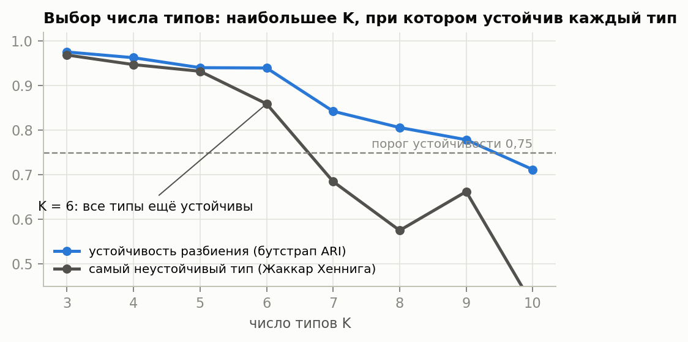
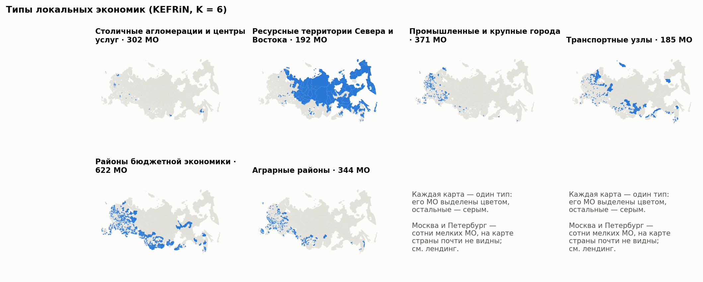
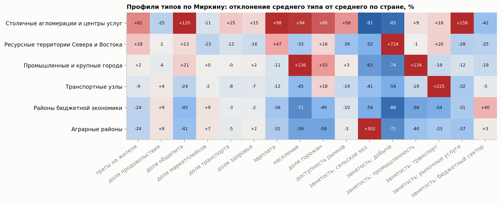
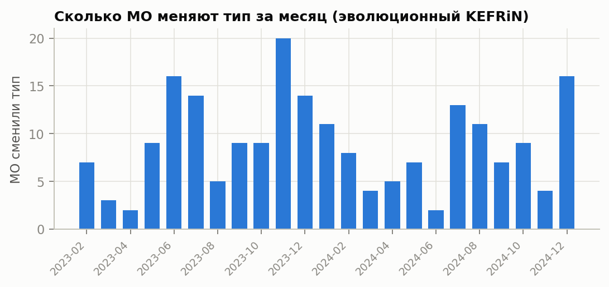
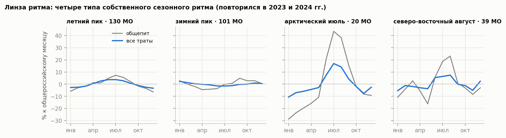

# Типы локальных экономик России: кластеризация атрибутированной сети муниципалитетов

Методологический отчёт. Онлайн-конкурс СберИндекса 2026, трек «Кластеризация».
Код, конфигурации и интерактивный лендинг — в репозитории проекта (`site/index.html`).

## 0. Коротко

**Задача.** Найти типы локальных экономик среди муниципальных образований (МО) России, проследить, как МО переходят
между типами, и объяснить типы экономически.

**Метод ДУЭТ в одной фразе.** Муниципалитет описывается двумя взглядами: *чем он живёт* (зарплаты, отрасли, население —
это атрибуты узла) и *как в нём тратят* (траектории безналичных трат жителей за 24 месяца — это рёбра сети).
Тип — группа МО, похожих и по экономической базе, и по образу трат.

**Результат.**

- **Шесть устойчивых типов** на 2 016 МО: промышленные и крупные города — 371, районы бюджетной экономики — 622, столичные агломерации и центры услуг — 302, ресурсные территории севера и востока — 192, транспортные узлы — 185, аграрные районы — 344. K = 6 — наибольшее число типов, при котором каждый тип
  воспроизводится на подвыборках (худший тип — 0,86 при пороге 0,75; при K = 7 — 0,68).
- **Сеть работает.** KEFRiN (признаки + сеть) — первый в рейтинге выбора и в общем рейтинге 13 методов, включая три
  графовые нейросети. Против k-means он меняет тип у 11% МО: доля соседей по тратам из того же типа
  растёт с 51% до 53% при почти той же компактности (силуэт 0,261 против 0,285).
- **Типы осмысленны.** Тип объясняет 71% разброса доли общепита и 59% доли продовольствия; типы
  только по Росстату, без трат, — 68% и 58%: связь «экономика → траты» есть в данных, а не
  создана моделью. Типы, построенные **без** зарплаты, объясняют 73% её разброса: проверка не замкнута на признаки.
- **Динамика проверена на синтетике с известной истиной:** метод находит 87% настоящих переходов за два
  месяца и почти не даёт ложных. Вес памяти α = 0,5 независимо подтверждён AFFECT (α ≈ 0,55).
  88 МО сменили тип насовсем; как группа смены значимы (в 3,6 раза сильнее, чем у стабильных МО), отдельные — кандидаты.
- **Ритм.** У 290 МО свой сезонный ритм трат, повторившийся в оба года; каждая трактовка проверена составом корзины (§8).

**Что нового.** Атрибуты — производство и доходы, рёбра — потребление; поправка «место работы ≠ место жительства» для
районов Москвы и Петербурга; восемь правил ребра с измеренным влиянием на типы; протокол выбора метода с контрольной
группой; калиброванная синтетика для динамики; линза ритма; лендинг с паспортом МО и экономическими двойниками.

| Критерий | Где в отчёте |
|---|---|
| Простое объяснение методологии (15%) | §0, §1 (схема), формулы — в приложении А |
| Сетевая и атрибутивная структура (15%) | §3, §4 |
| Сравнение методов (15%) | §5 (13 методов: 8 в рейтинге выбора, 5 контрольных), §7 (динамика), приложение Б |
| ICVI: SW, CH, S_Dbw, AVI, AVU, MQ (15%) | §5.2 (включая BasicMQ), приложения А и Б |
| Интерпретация, воспроизводимость, обоснованность (30%) | §6–§9, §11 |
| Визуализация (10%) | лендинг `site/index.html`, рис. 1–6 |

## 1. Схема решения

1. **Данные** → панель 2 016 МО × 24 месяца × 6 категорий трат + Росстат + доступность рынков (`s02_panel.py`).
2. **Атрибуты узла** — экономическая база МО и уровень трат (§3).
3. **Рёбра** — сходство траекторий трат; сравнены восемь правил (`s03_edges.py`, `s07_edge_effect.py`, §4).
4. **Кластеризация** — восемь методов, шесть индексов качества, рейтинг Алескерова; выбор K по устойчивости (`s06_methods.py`, `s05_choose_k.py`, §5).
5. **Интерпретация** — профили по Миркину, формулы типов (FCA), паттерны Алескерова–Мячина, внешняя проверка (`s11_types.py`, §6).
6. **Динамика** — 24 помесячные сети, эволюционная кластеризация, проверка на синтетике, переходы, события MONIC (`s08_dynamics.py`, `s09_synthetic.py`, `s12_transitions.py`, §7).
7. **Ритм** — сезонные подписи МО (`s10_rhythm.py`, §8).

Все гиперпараметры — в `configs/pipeline.yaml`, имена типов — в `configs/typology.yaml`; весь конвейер — `python scripts/run.py`.

### Метод ДУЭТ

Наша связка шагов оформлена как единый метод **ДУЭТ** (DUET — DUal-view Evolutionary Typology, «типология по двум
взглядам с эволюционным отслеживанием»). Отдельные блоки опираются на опубликованные работы (KEFRiN — Shalileh,
Mirkin, 2022; эволюционная кластеризация — Chakrabarti et al., 2006; AFFECT — Xu et al., 2014), а их сочетание,
разделение ролей данных и протокол проверки предложены и проверены в этой работе.

1. **Разделение взглядов.** Атрибуты узла — только экономическая база («чем живёт»: Росстат, доступность рынков,
   уровень трат); рёбра — только поведение трат («как тратит»: DTW по траекториям корзины за 24 месяца). Одни и те
   же данные не учитываются дважды, поэтому вклад сети измерим (§4.3).
2. **Совместная типология.** KEFRiN с косинусным расстоянием: у каждого типа два центра — в признаках и в строках
   модулярностной матрицы; вес сети ξ уравнивает разброс двух пространств. K выбирается как наибольшее, при котором
   устойчив каждый тип (Жаккар Хеннига ≥ 0,75).
3. **Эволюционное отслеживание.** 24 помесячные сети; срез сглаживается памятью α с тёплым стартом от прошлого
   месяца. α подтверждена дважды: калиброванной синтетикой с известной истиной и адаптивным AFFECT.
4. **Протокол выбора с контрольной группой.** Правило выбора задано до сравнения (рейтинг Алескерова по z-оценкам
   шести ICVI и бутстрапу); контрольные методы — графовые нейросети, Louvain, Ward со связностью — добавлены
   после выбора и показаны отдельно; рейтинг проверен правилами Борда и Коупленда, BasicMQ и внешней сетью.

## 2. Данные

| Источник | Что взято | Покрытие |
|---|---|---|
| СберИндекс, потребительские безналичные расходы на уровне МО (архив хакатона, CC BY-SA 4.0) | средние траты жителя в месяц, ₽: всего и 5 категорий | 2 190 МО, 2023-01…2024-12; 2 016 с полной историей |
| СберИндекс, индекс доступности рынков | объём доступного внешнего рынка, 0–1000 | 99,4% МО панели |
| СберИндекс, автодорожные связи МО | расстояние по дорогам между центрами МО | 5,9 млн пар |
| СберИндекс, справочник и границы МО | названия, тип, регион, ОКТМО, центры, полигоны | все МО панели |
| СберИндекс, индекс покупательской мобильности (API) | средняя дальность покупок, км | 279 МО (СЗФО) — только для проверки |
| Росстат, БД показателей МО через «Если быть точным» (CC BY 4.0) | население (всё и городское), среднемесячная зарплата и численность работников по разделам ОКВЭД2, 2024 г. | 99% МО |

Шестая часть корзины — «прочее» = все траты − пять категорий. Публичная выгрузка API ключуется по названию МО
(одноимённые МО разных регионов неразличимы), поэтому основой служит архив хакатона с `territory_id`.
В панели нет 12 регионов (в том числе Краснодарский край, Ростовская область, Крым, Дагестан). Росстат не публикует
занятость в отраслях с малым числом предприятий, поэтому доли шести укрупнённых отраслей в сумме дают в среднем 0,92.

**Поправка «место работы ≠ место жительства».** Росстат считает работников по месту работы. Во внутригородских
территориях Москвы и Петербурга это бессмысленно: в «спальном» Дачном 2,5 тыс. рабочих мест на 70 тыс. жителей,
и структура «занятости» описывает несколько местных организаций. Жители таких районов работают по всему городу, поэтому
242 внутригородским территориям присвоены общегородские доли отраслей и зарплата (взвешенно по числу работников).

## 3. Атрибуты узла: «чем живёт» МО

| Блок | Признаки | Зачем |
|---|---|---|
| Доходы | логарифм средней зарплаты | уровень оплаты труда |
| Размер и урбанизация | логарифм населения, доля горожан | город или село, крупный или малый |
| Положение | логарифм индекса доступности рынков | удалённость, логистика |
| Структура занятости | доли: сельское хозяйство; добыча; промышленность, энергетика и строительство; транспорт; прочие рыночные услуги; бюджетный сектор | экономическая специализация (транспорт выделен отдельно: иначе железнодорожные узлы с 25–50% занятых в транспорте выглядят как «сервисные» столицы) |
| Уровень трат | логарифм трат на жителя минус медиана по всем МО в том же месяце | «сколько тратят» без инфляции и общероссийской сезонности |

Все признаки стандартизованы (z-оценки), хвосты обрезаны на ±4σ: иначе несколько добывающих МО с долей добычи
выше 70% доминировали бы в расстояниях.

**Почему структура трат — не в атрибутах, а в рёбрах.** Тип локальной экономики — это прежде всего её база: что
производят и сколько зарабатывают. Образ трат описывает, как эта база превращается в жизнь людей. Мы кладём базу
в атрибуты, а потребление — в связи, и требуем, чтобы тип был согласован с обоими. Бонус: структура трат не входит
в атрибуты, и её связь с типами можно проверить на контрольной типологии без данных о тратах (§6.3).

## 4. Рёбра: правило «экономической близости»

**Одна сеть для типологии, 24 сети для динамики.** Тип локальной экономики — устойчивая характеристика: экономическая
база меняется годами, а не месяцами. Поэтому сама типология строится на одной сети, где ребро сравнивает *траектории*
трат за все 24 месяца (DTW): так связь отражает образ трат, а не случайности одного месяца, и сезон не путается с типом.
Помесячные сети (§7) строятся из корзины каждого месяца и отвечают на другой вопрос — *кто и когда сменил тип*.
Разделение задано заранее: типология — по полной траектории, динамика — по месячным срезам, связанным памятью α.

### 4.1. Восемь правил

Для каждого МО строится вектор или ряд потребления (8 каналов по месяцам: уровень трат, CLR-координаты шести долей
корзины, остаток кривой Энгеля). CLR — центрированный логарифм отношения: доли в сумме дают 1, и обычные расстояния
между ними искажены (геометрия Айчисона). Правила ребра:

- **косинус** профиля трат (средние за 24 месяца) — «тратят одинаково»;
- **гауссово ядро** с локальным масштабом (Zelnik-Manor & Perona) — то же, но нелинейно;
- **корреляция рядов** (Пирсон по 24 месяцам × 8 каналов без собственного среднего МО) — «движутся вместе»;
- **лаговая корреляция** — максимум корреляции уровня трат по сдвигам ±2 месяца — «один МО опережает другой»;
- **DTW** — динамическое выравнивание траекторий (окно 2 месяца) — «одинаковая траектория с допуском по времени»;
- **дороги** — exp(−d/200 км) по автодорожным расстояниям СберИндекса — «соседи»;
- **сходство экономической базы** — косинус атрибутов (контрольное правило: дублирует атрибуты);
- **слияние SNF** (Similarity Network Fusion, Wang et al., Nature Methods 2014) трёх взглядов — «как тратят» (DTW),
  «чем живут» (экономическая база) и «где» (дороги). Каждая сеть итеративно диффундирует по kNN-структуре двух других:
  остаются связи, поддержанные несколькими взглядами, а видные только в одном затухают.

Разрежение одно для всех: каждый МО связан с 15 самыми похожими (kNN, объединение), вес ребра — сходство.

### 4.2. Что измеряет каждое правило

| Правило | рёбер внутри региона | похожесть соседей: зарплата | уровень трат | доля маркетплейсов | занятость в добыче | модулярность |
|---|---|---|---|---|---|---|
| косинус профиля трат | 22% | 0,79 | 0,91 | 0,86 | 0,21 | 0,74 |
| гауссово ядро | 23% | 0,83 | 0,94 | 0,90 | 0,23 | 0,74 |
| корреляция рядов | 27% | 0,71 | 0,71 | 0,54 | 0,21 | 0,57 |
| лаговая корреляция ±2 мес. | 17% | 0,52 | 0,61 | 0,35 | 0,11 | 0,64 |
| **DTW траекторий (основное)** | 24% | 0,84 | 0,94 | 0,88 | 0,23 | 0,69 |
| близость по дорогам | 71% | 0,80 | 0,75 | 0,63 | 0,34 | 0,87 |
| сходство экономической базы (контроль) | 22% | 0,91 | 0,82 | 0,57 | 0,88 | 0,80 |
| слияние SNF: траты + база + дороги | 64% | 0,89 | 0,87 | 0,76 | 0,55 | 0,82 |

*«Похожесть соседей» — корреляция показателя на двух концах ребра. Модулярность — у разбиения Leiden на этом графе.*

Выводы. (1) Правила потребления делятся на два семейства, которые почти не пересекаются по рёбрам: *профиль*
(косинус, ядро, DTW; общих рёбер 43–57%) и *со-движение* (корреляции; общих рёбер с профилем 4–9%).
SNF действительно сочетает взгляды (общих рёбер: с DTW 18%, с базой 19%, с дорогами 42%), но география в нём
перевешивает (64% рёбер внутри региона), а сообщества получаются такими плотными, что сеть подавляет признаки:
KEFRiN на SNF-графе даёт силуэт 0,069 и почти другое разбиение (ARI с основным 0,24). Поэтому SNF
оставлен как альтернатива, а не как основа: экономический тип не должен сводиться к «соседи по карте».
(2) Соседи по профилю трат похожи по зарплате (0,77–0,81), хотя зарплата в рёбрах не участвует, — потребление
действительно отражает экономику. (3) Дорожная сеть на 71% состоит из рёбер внутри региона: она описывает географию.
(4) У 49% рёбер лаговой сети лучший сдвиг ненулевой, но на 24 месяцах это в основном шум: лаговая сеть слабее всех
связана с экономикой (похожесть по зарплате 0,45).

**Выбор: DTW.** DTW сочетает уровень и структуру корзины, допускает сдвиг сезонных пиков на месяц-два (у северных
и южных МО они приходятся на разные месяцы) и даёт высокую похожесть соседей по зарплате (0,81) и по уровню трат (0,94).

### 4.3. Как правило ребра меняет типологию

*Таблица — в приложении Д.1.*
Правило ребра заметно влияет на результат. Близкие по смыслу правила дают близкие типологии (косинус профиля — почти
та же, что DTW), со-движение рядов и лаговая корреляция сдвигают границы типов умеренно, а гауссово ядро, дороги
и контрольный граф «сходства базы» — сильно. Ни одно правило не делает типы региональными: ARI с регионом ≈ 0,09.

**Что сеть добавляет к признакам.** KEFRiN на DTW-графе и k-means на тех же признаках согласуются с ARI 0,78:
сеть меняет тип у 221 МО (11%). Доля соседей по тратам, попавших в тот же тип, растёт по всем МО
с 51% до 53%, а у сменивших тип — с 32% до 48%: сеть переносит МО к тем, на кого
он похож по образу жизни.

## 5. Методы, индексы качества и выбор числа типов

### 5.1. Методы

- **Только признаки:** k-means, Ward, смесь гауссиан (GMM).
- **Только сеть:** спектральная кластеризация, Leiden (разрешение подбирается под K).
- **Признаки и сеть вместе:** KEFRiN (Shalileh & Mirkin, 2022) с евклидовым (KEFRiN-e) и косинусным (KEFRiN-c)
  расстоянием; CANUS (Shalileh, 2025) — код автора, скачивается скриптом на закреплённом коммите.
- **Глубокие графовые нейросети (GNN)** — современный «нейросетевой» ответ на ту же задачу, тоже видят и признаки, и сеть
  (свои компактные реализации на PyTorch по статьям, `src/uklad/gnn.py`):
  GAE + k-means (Kipf & Welling, 2016) — графовый автоэнкодер сжимает МО в 16-мерный вектор, по которому можно
  восстановить его связи, затем k-means; DAEGC (Wang et al., IJCAI 2019) — то же с графовым вниманием и самообучением
  на собственных мягких метках; DMoN (Tsitsulin et al., JMLR 2023) — GNN, которая напрямую максимизирует модулярность
  со штрафом за слипание кластеров.

**KEFRiN своими словами.** Это k-means, у которого у каждого кластера два центра: в пространстве признаков и в
пространстве связей. МО относится к кластеру, к обоим центрам которого он в сумме ближе всего. Строка связей МО —
это строка модулярностной матрицы B = A − kkᵀ/2m: сколько у МО связей с каждым другим МО *сверх ожидаемого
случайно*. Вес сети ξ уравнивает суммарный разброс двух пространств. Косинусная версия сравнивает направления
векторов, а не длины: для строки связей это «с кем связан», а не «сколько связей». Реализация — своя, по формулам
статьи (`src/uklad/partition.py`): у кода авторов нет лицензии.

### 5.2. Индексы качества (ICVI)

- В пространстве признаков: **SW** (силуэт, ↑), **CH** (Калински–Харабаш, ↑), **S_Dbw** (разброс плюс плотность между кластерами, ↓).
- В сети: **AVI** (средняя изолированность — доля веса связей, оставшаяся внутри кластера, ↑), **AVU** (средняя
  «слитость» пар кластеров, ↓), **MQ** — модулярность Q (↑).

Формулы — в приложении А. AVI, AVU и модулярность сверены с кодом библиотеки Pattern Лаборатории СберИндекс:
расхождение не больше 10⁻¹⁵ на случайных графах. Под MQ мы понимаем модулярность Ньюмана — Гирвана (так метрика
называется в Pattern). Модульное качество Манкоридиса в варианте TurboMQ на неориентированном графе вырождается
в K · AVI и ничего к AVI не добавляет, поэтому считаем и исходный **BasicMQ** (Mancoridis et al., 1998): средняя
связность внутри типа μᵢ/Nᵢ² минус средняя связность между типами εᵢⱼ/(2NᵢNⱼ). Он штрафует межтиповые связи и
учитывает размеры типов. Если в рейтинге заменить модулярность на BasicMQ, KEFRiN-c остаётся 1-м по
пороговому агрегированию и 1-м по Борда (`outputs/method_comparison/ranking_mq_basic.csv`).

Индексы разных методов несравнимы «в лоб»: AVI случайного разбиения ≈ 1/K, CH растёт на сферических кластерах.
Поэтому для каждого индекса считаем и **z-оценку против перестановки меток** (50 перестановок при тех же размерах
кластеров): насколько разбиение лучше случайного.

### 5.3. Сравнение методов при K = 6

| Метод | место (Алескеров) | место (Борда) | SW ↑ | CH ↑ | S_Dbw ↓ | AVI ↑ | AVU ↓ | MQ ↑ | бутстрап ↑ |
|---|---|---|---|---|---|---|---|---|---|
| KEFRiN-c (признаки+сеть) | 1 | 1 | 0,261 | 613 | 0,559 | 0,509 | 0,511 | 0,342 | 0,94 |
| KEFRiN-e (признаки+сеть) | 2 | 2 | 0,283 | 653 | 0,499 | 0,485 | 0,491 | 0,325 | 0,93 |
| k-means (признаки) | 3 | 3 | 0,285 | 656 | 0,484 | 0,460 | 0,484 | 0,303 | 0,97 |
| CANUS (признаки+сеть) | 4 | 5 | 0,188 | 477 | 0,569 | 0,481 | 0,544 | 0,343 | 0,59 |
| Ward (признаки) | 5 | 4 | 0,225 | 551 | 0,563 | 0,476 | 0,487 | 0,302 | 0,54 |
| GMM (признаки) | 5 | 6 | 0,121 | 370 | 0,663 | 0,449 | 0,526 | 0,267 | 0,64 |
| Leiden (сеть) | 7 | 6 | 0,081 | 287 | 0,765 | 0,854 | 0,508 | 0,652 | 0,50 |
| спектральная (сеть) | 7 | 8 | 0,047 | 242 | 0,627 | 0,853 | 0,527 | 0,605 | 0,78 |

*В таблице — сырые значения индексов; места считаются не по ним, а по z-оценкам (таблица ниже). Бутстрап — 20 подвыборок
по 80% МО; для CANUS — 5 (один запуск идёт около 5 минут). Места — пороговое агрегирование Алескерова
(Aleskerov, Yakuba, Yuzbashev, 2007) по z-оценкам шести ICVI и бутстрап-устойчивости: каждый критерий ставит методу оценку 1/2/3 (лучшая, средняя, худшая треть), выше тот,
у кого меньше «троек», при равенстве — меньше «двоек». В отличие от суммы мест (Борда), провал по одному индексу
нельзя «купить» успехом по другому.*

**Выбор метода и честная оговорка.** Правило выбора задано до сравнения: основной метод — первый по пороговому
агрегированию. Это **KEFRiN-c**; правило Борда ставит его первым. Но честно скажем: **три лидера почти равны.**
KEFRiN-c уступает k-means в компактности (силуэт 0,261 против 0,285) и устойчивости (0,94 против
0,97), выигрывая в согласии с сетью (MQ 0,342 против 0,303, AVI 0,509 против 0,460).
Разбиения тройки близки: ARI KEFRiN-c с k-means 0,78, с KEFRiN-e 0,82. Все три — варианты
«k-means по признакам с учётом сети или без неё», и выводы о типах от выбора между ними почти не зависят.
Ещё одна оговорка: число типов (§5.4) и косинусная метрика подбирались на основном методе, что даёт ему небольшое
преимущество; k-means при том же K устойчив не хуже (бутстрап 0,97). Сетевые методы (Leiden, спектральная)
максимизируют модулярность, но их типы не компактны в признаках (SW ≈ 0) и неустойчивы; Ward и GMM неустойчивы;
CANUS на наших данных уступает KEFRiN почти по всем индексам и неустойчив (бутстрап 0,59, по 5 подвыборкам).

**Устойчивость рейтинга.** Рейтинг пересчитан в восьми вариантах (Алескеров или Борда × с AVU или без × с бутстрапом или без): KEFRiN-c первый в 8 из 8. Таблица вариантов и z-оценки — в приложении Б. Третье правило, Коупленда (метод побеждает другой, если лучше по большинству критериев), ставит
KEFRiN-c 2-м, а первым — k-means: попарно k-means чуть чаще выигрывает по компактности. Это то же
наблюдение «лидеры почти равны», только с другой стороны (`outputs/method_comparison/ranking_copeland.csv`).

**Проверка на внешней сети.** Разбиения всех 13 методов оценены на сети, которая в их построении не участвовала:
15 ближайших МО по железной дороге (данные СберИндекса о связях, 1 262 МО со связями). Выше всех ожидаемо сетевые
методы и нейросети — их типы во многом географические. KEFRiN-c занимает 7-е место, k-means — 11-е:
сеть трат делает типы заметно связнее и на независимой сети (средняя z-оценка AVI, AVU и MQ 50 против
38), хотя география в рёбрах не участвует (`outputs/method_comparison/external_railway.csv`).

**Почему не нейросеть.** Пять методов добавлены после выбора как внешний контроль: DAEGC, Ward со связностью, DMoN, GAE + k-means, Louvain. Правило выбора основного метода задано до их добавления, поэтому рейтинг выбора выше — по восьми исходным методам. В общем рейтинге всех 13 методов (таблица ниже) KEFRiN-c остаётся на 1-м месте (делит его с KEFRiN-e, DAEGC); места относительны (трети по каждому критерию), и новые участники сдвигают пороги. По сути нейросети ведут себя как сетевые методы: у лучшей из них, DAEGC, модулярность MQ 0,632 против 0,342 у KEFRiN-c, но силуэт 0,068 против 0,261 и устойчивость на бутстрапе 0,62 против 0,94. Нейросеть группирует МО по тому, с кем они связаны, а не по тому, чем они живут, и от подвыборки к подвыборке даёт заметно разные типы. Для экономической типологии это хуже: у типа должен быть понятный портрет по признакам, и он не должен зависеть от случайного зерна. KEFRiN задаёт вес сети явно (ξ), а его центры читаются как профиль типа. Ward с ограничением связности — другой простой способ учесть сеть — неустойчив (бутстрап 0,54).

Полная таблица всех методов — в приложении Б.3.

### 5.4. Число типов

*Таблица — в приложении Д.2.*
Индексы SW и CH почти монотонно падают с K, S_Dbw падает — внутреннего оптимума у них нет, и это ожидаемо для
данных без резких границ. **Индексы здесь противоречат друг другу, и это нужно сказать прямо:** силуэт лучше всего при K = 4,
CH, AVI и модулярность — при K = 3, а S_Dbw и AVU всё время улучшаются с ростом K. Свести их в одно «лучшее K» нельзя без произвольных
весов, поэтому решающим критерием выбрана устойчивость, которая не зависит от формы кластеров. Поэтому K выбирается по **устойчивости**: 20 подвыборок по 80% МО, ARI с полным разбиением
и для каждого кластера — средний максимальный Жаккар (Hennig, 2007; > 0,75 — устойчивый паттерн). **K = 6 —
наибольшее K, при котором устойчив каждый тип** (рис. 2): худший тип 0,86, при K = 7 — 0,68.
Устойчивы и меньшие K, но берём наибольшее устойчивое: цель — как можно более подробная экономическая типология,
а каждый лишний тип должен воспроизводиться на подвыборках. Так при K = 6 отделились транспортные узлы: при K = 5 (тот же метод и seed)
110 из 185 из них сливаются с ресурсными территориями, остальные расходятся по аграрным, промышленным и бюджетным. Порог 0,75 — общепринятый у Хеннига; в таблице для справки дан и более строгий 0,85.



## 6. Типы



### 6.1. Профили

| Тип (медианы) | МО | траты, ₽/мес | еда, % | общепит, % | маркетпл., % | зарплата, ₽ | население | горожане, % | доступность | с/х, % | добыча, % | промышл., % | бюджет, % |
|---|---|---|---|---|---|---|---|---|---|---|---|---|---|
| Столичные агломерации и центры услуг | 302 | 46 240 | 33,0 | 7,5 | 11,9 | 131 928 | 77 377 | 100 | 526 | 0,0 | 0,4 | 14,6 | 21,5 |
| Ресурсные территории Севера и Востока | 192 | 35 377 | 43,0 | 3,7 | 11,0 | 113 301 | 24 354 | 70 | 202 | 0,5 | 19,5 | 13,5 | 32,6 |
| Промышленные и крупные города | 371 | 29 095 | 42,2 | 4,0 | 13,8 | 66 408 | 61 143 | 88 | 336 | 0,4 | 0,0 | 38,0 | 34,6 |
| Транспортные узлы | 185 | 25 284 | 46,1 | 2,3 | 13,7 | 65 633 | 25 382 | 65 | 272 | 0,9 | 0,0 | 12,5 | 43,2 |
| Районы бюджетной экономики | 622 | 21 309 | 48,3 | 1,6 | 15,1 | 47 810 | 13 628 | 0 | 312 | 0,0 | 0,0 | 5,3 | 62,8 |
| Аграрные районы | 344 | 21 240 | 47,5 | 1,7 | 14,6 | 52 984 | 18 616 | 0 | 326 | 19,5 | 0,0 | 6,5 | 45,9 |



- **Столичные агломерации и центры услуг** — Москва, Петербург, ближнее Подмосковье и крупнейшие сервисные центры
  (Екатеринбург, Тюмень, Владивосток, Хабаровск, Иркутск). Половина занятых — в рыночных услугах, зарплата почти втрое
  выше, чем в районах бюджетной экономики; доля общепита 7,5% трат (вчетверо выше, чем на селе), продовольствия — 33%:
  закон Энгеля в чистом виде.
- **Ресурсные территории Севера и Востока** — Сургут, Нижневартовск, Норильск, Якутск, Камчатка, Сахалин: добыча — 20%
  занятых, зарплата 113 тыс. ₽, худшая доступность рынков; маркетплейсов меньше всех (11% трат) — граница доставки.
- **Промышленные и крупные города** — Новосибирск, Казань, Нижний Новгород, Уфа и сотни промышленных городов:
  обрабатывающая промышленность — 38% занятых, траты немного выше средних.
- **Транспортные узлы** — железнодорожные и портовые города и районы: Тайгинский, Боготол, Ртищевский, Коношский, Няндомский районы,
  Находка, Тайшет. Каждый пятый работник — в транспорте (медиана по стране 5%). Пока транспорт был частью «рыночных услуг»,
  эти МО попадали к столицам; выделенный в атрибуты, он даёт отдельный, устойчивый тип.
- **Районы бюджетной экономики** — самый массовый тип (622 МО): 63% рабочих мест — бюджетные (школы, больницы,
  администрации), самые низкие зарплаты, на продовольствие — почти половина корзины.
- **Аграрные районы** — каждый пятый работник в сельском хозяйстве; траты на уровне бюджетных районов (на 15% ниже медианы страны), зато доля маркетплейсов одна из самых высоких.

Формулы типов в терминах анализа формальных понятий и паттерны Алескерова–Мячина — в приложении В.

### 6.2. Внешняя проверка

**Проверка на отложенных признаках.** Зарплата, занятость и население входят в признаки модели, поэтому то, что типы
«объясняют зарплату», само по себе ничего не доказывает. Чтобы проверка не была замкнутой, типология строилась заново
**без** одного блока признаков, и затем проверялось, объясняют ли такие типы показатель, которого модель не видела
(`scripts/s23_validation.py`, `outputs/validation/held_out.csv`). Типы, построенные без зарплаты, объясняют
73% разброса зарплаты (с зарплатой в модели — 76%); без занятости — в среднем 30% разброса
долей занятых по отраслям; случайные разбиения тех же размеров — меньше 1%. Все 11 отложенных показателей
объясняются значимо лучше случайного (p < 0,01). Значит, типы улавливают экономическую базу МО через остальные признаки
и сеть трат, а не повторяют её по построению.


*Таблица — в приложении Д.3.*
*η² — доля разброса показателя, объяснённая типами. Структура трат не входит в атрибуты, но входит в рёбра (DTW),
поэтому для честной проверки рядом дана контрольная типология: k-means только по признакам Росстата и доступности
рынков, без уровня трат и без сети — она не видит трат вовсе. Индекс мобильности — отдельный набор СберИндекса,
в модели не участвует.*

Контрольная типология объясняет структуру трат почти так же (общепит 68% против 71%,
продовольствие 58% против 59%): то, что столицы тратят на общепит в разы больше, а бюджетные
районы — почти половину на еду, следует из экономической базы МО; сеть добавляет к этому различия в доле транспорта
и маркетплейсов.

Индекс покупательской мобильности (медиана, км): столичные агломерации и центры услуг — 4,8 км, промышленные и крупные города — 1,2 км, ресурсные территории севера и востока — 0,8 км, транспортные узлы — 0,6 км, аграрные районы — 0,6 км, районы бюджетной экономики — 0,5 км. Он убывает вместе с урбанизацией типа.

### 6.3. Кто уходит в отрыв

Тип — это ещё и уровень жизни. Медианные траты на жителя каждого типа относительно медианы России по месяцам
(`scripts/s13_checks.py`, среднее за год, чтобы сезон не мешал):

*Таблица — в приложении Д.4.*
Разрыв между самым богатым и самым бедным типом за год вырос с 97 до 101 п. п.
(бутстрап по МО внутри типов, 1000 повторов: изменение от +2,9 до +4,9 п. п., 95% интервал при фиксированной типологии; неопределённость самих типов он не учитывает — рост значим, но невелик): столичные агломерации и центры услуг
уходят вперёд, аграрные районы отстают сильнее. Разброс логарифма трат между МО (σ-сходимость) растёт с 0,314
до 0,325: неравенство между муниципалитетами за два года не сокращается. Тип объясняет 72%
этого разброса (в оба года) — почти всё неравенство в тратах лежит между типами, а не внутри них.

## 7. Динамика типов

**Коротко.** 24 помесячные сети, три способа отслеживания; вес памяти α = 0,5 выбран по таблице вариантов и
подтверждён дважды: на синтетике с известной истиной и адаптивным методом AFFECT, который сам выбирает α ≈ 0,55.

**Помесячные сети.** Для месяца t атрибуты — экономическая база (постоянна) и уровень трат месяца t; рёбра — kNN по
сходству корзины месяца t (скользящее среднее за 3 месяца, чтобы разовые всплески не рвали связи).

**Три способа отследить типы.**

1. Независимо по месяцам: KEFRiN на каждом месяце, метки сопоставляются венгерским алгоритмом.
2. **Эволюционная кластеризация** (Chakrabarti, Kumar, Tomkins, 2006): кластеризуется сглаженный срез
   Ỹₜ = α·Ỹₜ₋₁ + (1−α)·Yₜ, P̃ₜ = α·P̃ₜ₋₁ + (1−α)·Pₜ с тёплым стартом от меток прошлого месяца.
2a. **Адаптивная память AFFECT** (Xu, Kliger, Hero, Data Min. Knowl. Disc. 2014): то же сглаживание, но α подбирается
   в каждом месяце из данных как оптимальная усадка к истории, α*ₜ = Σ var(Wₜ) / (Σ var(Wₜ) + Σ (Ψₜ₋₁ − E[Wₜ])²);
   E и var оцениваются внутри типов прошлого месяца. Шум месяца велик по сравнению со сдвигом от истории — памяти больше.
3. Temporal Leiden — многослойная модулярность (Mucha et al., 2010), только сеть.

Смена типа засчитывается как **устойчивая**, если и старый, и новый тип держатся не меньше трёх месяцев.

| Способ | AMI соседних месяцев | смен в месяц | МО без смен | устойчивых переходов | доля устойчивых | SW (медиана) | MQ (медиана) | типов |
|---|---|---|---|---|---|---|---|---|
| независимо по месяцам | 0,955 | 1,40% | 88,2% | 166 | 26% | 0,262 | 0,319 | 6 |
| эволюционный KEFRiN, α=0.25 | 0,982 | 0,48% | 93,8% | 164 | 74% | 0,260 | 0,322 | 6 |
| эволюционный KEFRiN, α=0.5 | 0,984 | 0,44% | 93,9% | 151 | 74% | 0,260 | 0,323 | 6 |
| эволюционный KEFRiN, α=0.75 | 0,989 | 0,31% | 94,6% | 122 | 85% | 0,259 | 0,325 | 6 |
| эволюционный KEFRiN, адаптивный α (AFFECT) | 0,985 | 0,42% | 94,1% | 146 | 76% | 0,260 | 0,324 | 6 |
| temporal Leiden, ω=0.5 | 0,747 | 20,31% | 0,9% | 3551 | 38% | −0,027 | 0,728 | 18 |
| temporal Leiden, ω=1.0 | 0,833 | 9,05% | 32,4% | 2118 | 50% | −0,027 | 0,721 | 11 |

При независимой кластеризации 1,4% МО меняют тип каждый месяц, и только 26% смен устойчивы —
это шум. Память α = 0,5 снижает долю смен до 0,44% в месяц (на 68%), 74% из них
устойчивы, а качество каждого месяца почти не меняется (SW 0,260 против 0,262, MQ 0,323
против 0,319). Temporal Leiden дробит МО на много мелких сообществ с отрицательным силуэтом. Сравнение с ним неравное: число сообществ
Leiden задать нельзя (получается 11–18 вместо 6), поэтому его строка показывает другой подход, а не проигрыш при равных условиях.

**Проверка выбора α данными.** α = 0,5 выбрана по таблице вариантов, то есть вручную. AFFECT подбирает вес
истории сам, без нашего участия, и получает α от 0,50 до 0,58 (медиана 0,55): данные сами
выбирают примерно ту же память. Результат AFFECT почти совпадает с основным (ARI меток за 24 месяца 1,00),
поэтому основным оставлен более простой вариант с постоянной α. Есть и вторая причина: AFFECT оптимизирует точность
оценки среза, а не скорость обнаружения перехода. На спокойных данных он копит память и замечает настоящий переход
позже, чем постоянная α = 0,5 (проверяется в `tests/test_pipeline.py` на синтетической панели).

**Проверка на синтетике с известной истиной** (`s09_synthetic.py`). На реальных данных нельзя узнать, какие смены
настоящие, поэтому способы отслеживания сравнены на синтетике, откалиброванной по реальной типологии: центры типов
и устойчивые отклонения МО — из данных, помесячный шум уровня трат — как в реальных рядах; в 12-м месяце 5% МО
по-настоящему переходят в ближайший тип. 800 МО, 3 повтора, два уровня шума.

| Шум | Способ | NMI с истиной | ложных смен на МО | мигранты найдены сразу | через 2 мес. | через 4 мес. |
|---|---|---|---|---|---|---|
| калиброванный | независимо | 0,77 | 3,35 | 65% | 58% | 52% |
| калиброванный | эволюционный, α=0.25 | 0,84 | 0,10 | 81% | 89% | 91% |
| калиброванный | эволюционный, α=0.5 | 0,83 | 0,06 | 46% | 87% | 89% |
| калиброванный | эволюционный, α=0.75 | 0,83 | 0,02 | 16% | 62% | 81% |
| шум ×2 по всем признакам | независимо | 0,70 | 4,54 | 69% | 78% | 65% |
| шум ×2 по всем признакам | эволюционный, α=0.25 | 0,79 | 1,33 | 78% | 89% | 90% |
| шум ×2 по всем признакам | эволюционный, α=0.5 | 0,81 | 0,75 | 48% | 87% | 88% |
| шум ×2 по всем признакам | эволюционный, α=0.75 | 0,81 | 0,31 | 17% | 59% | 83% |

Память нужна: без неё метод не отличает переход от шума (3,4 ложных смен на МО за два года). Чем больше α,
тем меньше ложных смен, но тем позже замечается настоящий переход. α = 0,5 через два месяца находит 87%
настоящих переходов (α = 0,25 — 89%) и даёт на 38% меньше ложных смен, чем α = 0,25.

События MONIC (Spiliopoulou et al., 2006) между январём 2023 и декабрём 2024: все 6 типов «выживают», распадов
и слияний нет. Это содержательный результат: экономическая структура страны за два года не перестроилась, менялись
отдельные пограничные МО.

**Направленные и возвратные переходы.** Правило «≥ 3 месяцев» отсекает шум, но не сезонность: северный город может
полгода жить в одном типе и к зиме вернуться в свой. Поэтому переходы разделены (`s12_transitions.py`): тип МО в начале
(мода января–марта 2023) и в конце (мода октября–декабря 2024) различаются — направленный переход, совпадают — возвратный.

Таблица направленных переходов по парам типов — в приложении Г.1.

Из 123 МО, менявших тип, 88 сменили его насовсем, 35 вернулись. **Насколько эти смены надёжны.** Для каждого МО, сменившего тип насовсем, «отрыв» к новому типу (разница
расстояний до центров старого и нового типа в пространстве KEFRiN) сравнен с тем же показателем у МО того же исходного
типа, которые тип не меняли; точка смены выбирается по данным, поэтому статистика — максимум по всем точкам разрыва
(`outputs/validation/transitions_significance.csv`). По отдельности значимы 28 из 88 переходов при
4,4 ожидаемых случайно (биномиальный p ≈ 10⁻¹⁵); медианный отрыв у сменивших тип в 3,6 раза больше,
чем у не менявших. **Как группа смены реальны, но после строгой поправки на множественность (Бенджамини — Хохберг, 5%)
ни один отдельный переход не доказан.** Поэтому конкретные МО из таблицы переходов — кандидаты для проверки, а не
установленные факты. Направленные переходы
объясняются динамикой относительного уровня трат: МО, поднимающиеся по лестнице типов (к крупным городам и
агломерациям), как правило, прибавили к своему уровню трат относительно страны, опускающиеся — потеряли.

Общий сдвиг, не меняющий типов, — **волна маркетплейсов**: медианная доля маркетплейсов выросла с 9,3% до 19,2%
трат, доля продовольствия снизилась с 45,3% до 42,4%. На лендинге это видно в «ландшафте Энгеля»: облако МО
опускается, а каждый декабрь прыгает вправо (траты на 20% выше обычного месяца).



## 8. Линза ритма: когда тратят

Ритм МО — помесячные траты за вычетом общероссийского месяца и собственного линейного тренда, усреднённые по двум годам.
Своим ритм признаётся, если (1) профиль 2023 г. коррелирует с профилем 2024 г. сильнее 95-го перцентиля
перестановочного нуля (те же корреляции для случайных пар «2023 одного МО — 2024 другого»; порог 0,64) и (2) амплитуда
выше медианы. Таких МО 290 (14%). Их профили сгруппированы k-means (K по силуэту).

*Таблица — в приложении Д.5.*


Арктический ритм — самый сильный сигнал в данных: в июле траты на 17% выше обычного, общепит — на 43%.

**Проверка трактовок.** Разные причины сезонности оставляют разный след в корзине: завоз поднимает продовольствие,
приток людей — услуги (общепит, здоровье), сезонная добыча связана с долей занятых в добыче. Ниже — средний профиль ритма
в его пиковый месяц по каждой категории, той же методикой, что и сам ритм (отклонение от общероссийского месяца
за вычетом собственного тренда МО, ×100; `scripts/s13_checks.py`). Поэтому «все траты» и «общепит» здесь совпадают с числами
выше, а размах в таблице ритмов (пик минус спад) больше пика.

Состав корзины в пиковый месяц по каждой трактовке — в приложении Г.2.

- **Арктический июль** — не завоз: продовольствие почти не растёт, а общепит, здоровье, маркетплейсы и транспорт —
  на 20–45%. Это похоже на приток людей: навигация, вахты, возвращение из отпусков, летние работы. Альтернатива,
  которую по нашим данным не исключить: летом растёт доля безналичных расчётов (приезжие платят картой) — для
  различения нужны данные о числе клиентов, их в открытом наборе нет.
- **Северо-восточный август.** Мы предполагали сезонную добычу (золото, артели) — версия **не подтвердилась**: из 39 МО
  18 — сельские улусы Якутии (Амгинский, Чурапчинский, Таттинский), у медианного МО занятых в добыче нет. Растут общепит
  (+23%) и здоровье (+16%), продукты — нет; след тот же, что у Арктики, только на месяц позже и слабее.
- **Летний пик** — слабый (+4%) и неоднородный: треть его МО (43 из 130) — ресурсные территории Севера (ЯНАО, Мурманская
  область, Коми, Сахалин), остальные — сельские районы Алтая, Карелии, Кировской и Костромской областей. Общий след —
  летний рост общепита и транспорта; «туризм и дачи» объясняет только сельскую часть, единой трактовки мы не даём.
  В таблице ритмов примеры — самые повторяемые МО, поэтому в них попали северные города.
- **Зимний пик** слабый (+2% в январе), его мы не интерпретируем.

## 9. Ограничения

**Где наш метод не лучше простых.** k-means на тех же признаках устойчивее на подвыборках (0,97 против
0,94), компактнее (силуэт 0,285 против 0,261) и выигрывает по правилу Коупленда. Сетевые методы
и нейросети сильнее по модулярности. Наш выбор — компромисс: типы почти так же компактны, как у k-means, и при этом
согласованы с сетью трат. Если нужна только компактность по признакам, k-means достаточно.


- 24 месяца — один полный годовой цикл: сезонность оценивается по двум повторениям, лаговые связи статистически слабы.
- Траты — модельная оценка СберИндекса (поправка на демографию и активность клиентов); «прочее» — остаток.
- Нет 12 регионов; Росстат засекречивает занятость в малых отраслях; контекст Росстата — годовой и фиксирован на 2024 г.
- Индекс мобильности покрывает только Северо-Западный округ.
- Типы ретроспективны: стандартизация использует все 24 месяца.

## 10. Литература

Shalileh S., Mirkin B. Community partitioning over feature-rich networks using an extended K-means method // Entropy. 2022. ·
Shalileh S. A filtered gradient descent clustering method to recover communities in attributed networks // IEEE Access. 2025. ·
Shalileh S., Antonov E., Tsyplakova D. Profiling consumption using attributed network clustering // Complex Networks & Their Applications XIV. 2026. ·
Biswas A., Biswas B. Defining quality metrics for graph clustering evaluation // Expert Systems with Applications. 2017. ·
Halkidi M., Vazirgiannis M. Clustering validity assessment: finding the optimal partitioning of a data set // ICDM. 2001. ·
Rousseeuw P. Silhouettes // J. Comput. Appl. Math. 1987. · Caliński T., Harabasz J. A dendrite method for cluster analysis // Comm. Stat. 1974. ·
Newman M., Girvan M. Finding and evaluating community structure in networks // Phys. Rev. E. 2004. ·
Mancoridis S. et al. Using automatic clustering to produce high-level system organizations of source code // IWPC. 1998. ·
Aleskerov F., Yakuba V., Yuzbashev D. A «threshold aggregation» of three-graded rankings // Math. Social Sciences. 2007. ·
Алескеров Ф. Т., Белоусова В. Ю., Егорова Л. Г., Миркин Б. Г. Анализ паттернов в статике и динамике // Бизнес-информатика. 2013. ·
Мячин А. Л. Pattern analysis in parallel coordinates based on pairwise comparison of parameters // Automation and Remote Control. 2019. ·
Ganter B., Wille R. Formal Concept Analysis. Springer, 1999. · Kuznetsov S. O. On stability of a formal concept // Ann. Math. Artif. Intell. 2007. ·
Mirkin B. Clustering: A Data Recovery Approach. CRC, 2012. · Hennig C. Cluster-wise assessment of cluster stability // CSDA. 2007. ·
Chakrabarti D., Kumar R., Tomkins A. Evolutionary clustering // KDD. 2006. · Mucha P. et al. Community structure in time-dependent, multiscale, and multiplex networks // Science. 2010. ·
Spiliopoulou M. et al. MONIC: modeling and monitoring cluster transitions // KDD. 2006. · Traag V. et al. From Louvain to Leiden // Sci. Rep. 2019. ·
Aitchison J. The statistical analysis of compositional data. 1986. · Sakoe H., Chiba S. Dynamic programming algorithm optimization for spoken word recognition // IEEE TASSP. 1978. ·
Zelnik-Manor L., Perona P. Self-tuning spectral clustering // NIPS. 2004. ·
Xu K., Kliger M., Hero A. Adaptive evolutionary clustering // Data Min. Knowl. Disc. 2014. ·
Wang B. et al. Similarity network fusion for aggregating data types on a genomic scale // Nature Methods. 2014. ·
Kipf T., Welling M. Variational graph auto-encoders // NIPS Workshop. 2016. ·
Wang C. et al. Attributed graph clustering: a deep attentional embedding approach // IJCAI. 2019. ·
Tsitsulin A. et al. Graph clustering with graph neural networks // JMLR. 2023. ·
Blondel V. et al. Fast unfolding of communities in large networks // J. Stat. Mech. 2008.

## 10а. Источники идей и что сделано самостоятельно

| Что | Источник | Как использовано |
|---|---|---|
| KEFRiN (кластеризация признаков и сети) | Shalileh, Mirkin, 2022 | своя реализация по формулам статьи (`src/uklad/partition.py`); код авторов не используется |
| CANUS | Shalileh, 2025 | **код автора** (github.com/Sorooshi/CANUS, коммит `754622a`), скачивается скриптом, в репозиторий не включён |
| AVI, AVU, MQ | библиотека Pattern Лаборатории СберИндекс | своя реализация, сверена с Pattern до 10⁻¹⁵ (`tests/test_quality.py`) |
| Эволюционная кластеризация, AFFECT | Chakrabarti et al., 2006; Xu, Kliger, Hero, 2014 | своя реализация (`src/uklad/tracking.py`) |
| SNF, GAE, DAEGC, DMoN | Wang et al., 2014; Kipf, Welling, 2016; Wang et al., 2019; Tsitsulin et al., 2023 | свои компактные реализации (`graphs.py`, `deep.py`) |
| Пороговое агрегирование, паттерны, FCA | Алескеров и др.; Мячин; Ganter, Wille; Кузнецов | своя реализация |
| Leiden, Louvain, k-means, Ward, GMM, спектральная | leidenalg, igraph, scikit-learn | библиотеки |

Самостоятельно: постановка «атрибуты — производство и доходы, рёбра — потребление», поправка «место работы ≠ место
жительства» для районов Москвы и Петербурга, сравнение восьми правил ребра и их влияния на типологию, протокол выбора
метода (рейтинг выбора и контрольные методы), калиброванная синтетика для проверки динамики, линза ритма с перестановочным
тестом, интерпретация типов и лендинг.

## 11. Воспроизводимость

```
pip install -r requirements.txt
python scripts/run.py            # скачивание (SHA-256), панель, графы, методы, динамика, интерпретация, рисунки, лендинг
python scripts/report.py       # этот отчёт: report/uklad_methodology.md и .pdf
pytest -q tests                      # проверки индексов качества, DTW, лаговой корреляции
```

Контрольные суммы: `python scripts/s19_checksums.py` записывает SHA-256 всех файлов `outputs/` в `outputs/CHECKSUMS.sha256`,
`python scripts/s19_checksums.py --check` после повторного прогона показывает, какие файлы не совпали байт в байт.

Seed = 42 во всех случайных шагах; гиперпараметры — `configs/pipeline.yaml`; CANUS — коммит `754622a`.
Все числа и таблицы этого отчёта подставляются из `outputs/` при сборке (`scripts/report.py`).
Протокол проверки в свежей копии репозитория, со скачиванием данных с нуля, — `docs/reproduce_check.md`.


*Приложения А–Д (формулы индексов, детали сравнения методов, дополнительные таблицы) — в `report/uklad_appendix.md`.*
